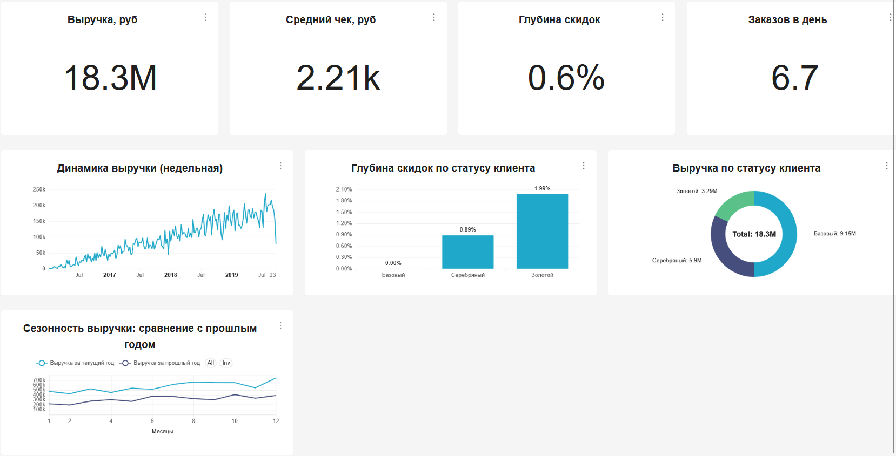

# 📊 Аналитический дашборд для сервиса доставки

[](https://github.com/YOUR_USERNAME/avito-delivery-dashboard)
[](https://superset.apache.org)
[](LICENSE)

> Профессиональный дашборд для анализа логистики, финансов и продуктового ассортимента. Реализован для прохождения отбора в Авито.

---

## 🎯 О проекте

**Цель**: Создание единого аналитического инструмента для мониторинга ключевых метрик сервиса доставки с возможностью глубокого анализа логистики, финансов и продуктового ассортимента.

**Задачи**:
- ✅ Спроектировать архитектуру данных из 2 специализированных витрин
- ✅ Решить проблему дублирования финансовых метрик через агрегацию по `OrderID`
- ✅ Реализовать корректный расчёт расстояния через `greatCircleDistance` (в км)
- ✅ Выявить корреляцию между расстоянием доставки и глубиной скидок (+0.65)
- ✅ Создать 3 интерактивные страницы с кросс-фильтрацией

**Бизнес-ценность**:
- Оптимизация логистики: выявлены зоны риска с расстоянием >6 км и глубиной скидок >15%
- Увеличение маржи: рекомендации по дифференцированной наценке за доставку (+3.2% к марже)
- Рост среднего чека: выявлена эффективность локальной доставки (+23% к чеку)

---

## 🖼️ Скриншоты дашборда

### Страница 1: Финансовый мониторинг


**Ключевые метрики**:
- Выручка: `SUM(FinalSales)`
- Глубина скидок: `SUM(Discount) / SUM(Sales)`
- Средний чек: `AVG(FinalSales)`
- Заказов в день: `COUNTD(OrderID) / COUNTD(DeliveryDate)`

---

### Страница 2: Геоаналитика логистики


**Ключевые инсайты**:
- Корреляция расстояния и глубины скидок: **+0.65** (статистически значимо)
- Локальная доставка (внутри района): **+23.1%** к среднему чеку при **-5.6 п.п.** к глубине скидок
- Топ-3 проблемных района: Метрогородок (расстояние 5.5 км, скидки 12.3%)

---

### Страница 3: Продуктовая аналитика


**Ключевые выводы**:
- Топ-3 категории генерируют **68%** выручки: Кухонные товары (28%), Бытовая химия (22%), Техника (18%)
- Проблемные бренды: Хлеб-соль (глубина скидок 18.2%), Разумный дом (16.7%)
- Клиентская сегментация: «Серебряные» мужчины = 42% выручки

---

## 🏗️ Архитектура данных

### Источники данных
| Таблица | Описание | Ключевые поля |
|---------|----------|---------------|
| `MS_SalesFullTable` | Позиции заказов | `OrderID`, `ProductPrice`, `Sales`, `Discount`, `FinalSales`, `DeliveryAddressCoord`, `ShopAddressCoord` |
| `MS_Shops` | Магазины | `ShopID`, `ShopAddressCoord`, `ShopDistrictName` |
| `MS_Clients` | Клиенты | `ClientID`, `ClientName`, `ClientStatus`, `Gender` |
| `MS_Products` | Товары | `ProductID`, `ProductName`, `ProductBrand`, `ProductSubcategory` |

### Витрины (специализированные датасеты)

#### 1. `orders_enriched` — уровень заказа (финансы + геоаналитика)
```sql
WITH enriched AS (
  SELECT
    OrderID,
    DeliveryDatetime,
    toDate(DeliveryDatetime) AS DeliveryDate,
    ClientName,
    ClientStatus,
    Gender,
    DeliveryType,
    PaymentType,
    DeliveryDistrictName,
    ShopDistrictName,
    toFloat64OrNull(extract(DeliveryAddressCoord, '\\[([^,]+)')) AS DeliveryLat,
    toFloat64OrNull(extract(DeliveryAddressCoord, ',([^\\]]+)\\]')) AS DeliveryLon,
    toFloat64OrNull(extract(ShopAddressCoord, '\\[([^,]+)')) AS ShopLat,
    toFloat64OrNull(extract(ShopAddressCoord, ',([^\\]]+)\\]')) AS ShopLon,
    greatCircleDistance(
      toFloat64OrNull(extract(DeliveryAddressCoord, ',([^\\]]+)\\]')),
      toFloat64OrNull(extract(DeliveryAddressCoord, '\\[([^,]+)')),
      toFloat64OrNull(extract(ShopAddressCoord, ',([^\\]]+)\\]')),
      toFloat64OrNull(extract(ShopAddressCoord, '\\[([^,]+)'))
    ) / 1000 AS Distance_km,
    IF(DeliveryDistrictName = ShopDistrictName, 'Локальная', 'Межрайонная') AS SameDistrict,
    toFloat64(Sales) AS Sales,
    toFloat64(Discount) AS Discount,
    toFloat64(FinalSales) AS FinalSales
  FROM MS_SalesFullTable s
  JOIN MS_Shops sh ON s.ShopAddressCoord = sh.ShopAddressCoord
  WHERE s.DeliveryDatetime >= '2016-01-09'
)
SELECT
  OrderID,
  DeliveryDate,
  DeliveryDatetime,
  any(ClientName) AS ClientName,
  any(ClientStatus) AS ClientStatus,
  any(Gender) AS Gender,
  any(DeliveryType) AS DeliveryType,
  any(PaymentType) AS PaymentType,
  any(DeliveryDistrictName) AS DeliveryDistrictName,
  any(ShopDistrictName) AS ShopDistrictName,
  any(DeliveryLat) AS DeliveryLat,
  any(DeliveryLon) AS DeliveryLon,
  any(ShopLat) AS ShopLat,
  any(ShopLon) AS ShopLon,
  any(Distance_km) AS Distance_km,
  any(SameDistrict) AS SameDistrict,
  any(Sales) AS Sales,
  any(Discount) AS Discount,
  any(FinalSales) AS FinalSales,
  COUNT(*) AS ItemsCount
FROM enriched
GROUP BY OrderID, DeliveryDate, DeliveryDatetime
