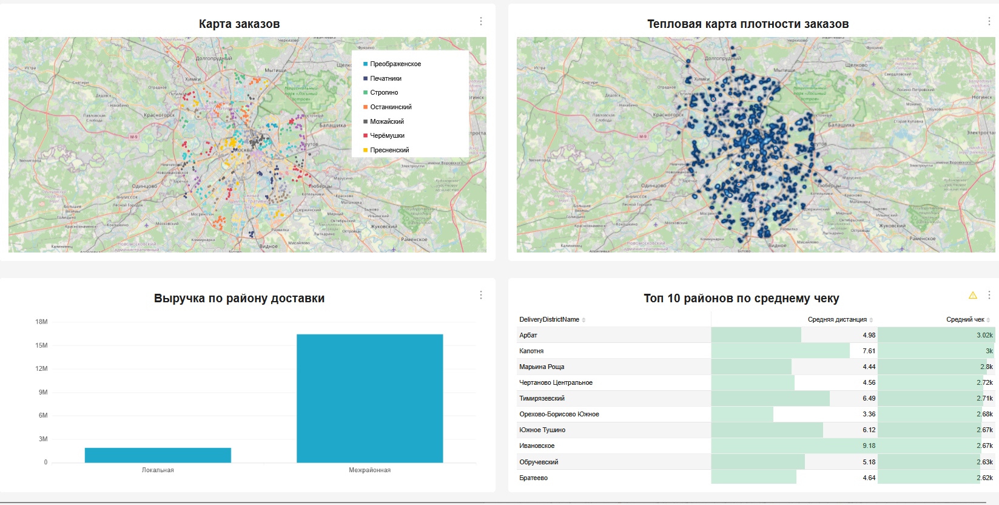
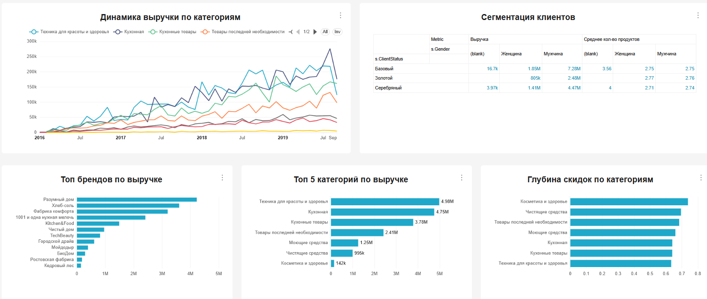

# Аналитический дашборд для сервиса доставки

[](https://github.com/YOUR_USERNAME/avito-delivery-dashboard)
[](https://superset.apache.org)
[](LICENSE)

> Профессиональный дашборд для анализа логистики, финансов и продуктового ассортимента. Реализован для прохождения отбора в Авито.

---

## О проекте

**Цель**: Создание единого аналитического инструмента для мониторинга ключевых метрик сервиса доставки с возможностью глубокого анализа логистики, финансов и продуктового ассортимента.

**Задачи**:
- Спроектировать архитектуру данных из 2 специализированных витрин
- Решить проблему дублирования финансовых метрик через агрегацию по `OrderID`
- Реализовать корректный расчёт расстояния в км
- Создать 3 интерактивные страницы

---

## Скриншоты дашборда

### Страница 1: Финансовый мониторинг


**Ключевые метрики**:
- Выручка: `SUM(FinalSales)`
- Глубина скидок: `SUM(Discount) / SUM(Sales)`
- Средний чек: `AVG(FinalSales)`
- Заказов в день: `COUNTD(OrderID) / COUNTD(DeliveryDate)`

---

### Страница 2: Геоаналитика логистики


---

### Страница 3: Продуктовая аналитика


---

## Архитектура данных

### Источники данных
| Таблица | Описание | Ключевые поля |
|---------|----------|---------------|
| `MS_SalesFullTable` | Позиции заказов | `OrderID`, `ProductPrice`, `Sales`, `Discount`, `FinalSales`, `DeliveryAddressCoord`, `ShopAddressCoord` |
| `MS_Shops` | Магазины | `ShopID`, `ShopAddressCoord`, `ShopDistrictName` |
| `MS_Clients` | Клиенты | `ClientID`, `ClientName`, `ClientStatus`, `Gender` |
| `MS_Products` | Товары | `ProductID`, `ProductName`, `ProductBrand`, `ProductSubcategory` |

### Витрины (специализированные датасеты)

#### 1. `orders` — уровень заказа (финансы + геоаналитика)
```sql
WITH enriched_orders AS (
  SELECT
    OrderID,
    DeliveryDatetime,
    toDate(DeliveryDatetime) AS DeliveryDate,
    ClientName,
    ClientStatus,
    Gender,
    DeliveryType,
    PaymentType,
    DeliveryDistrictName,
    ShopDistrictName,
    toFloat64OrNull(extract(DeliveryAddressCoord, '\\[([^,]+)')) AS DeliveryLat,
    toFloat64OrNull(extract(DeliveryAddressCoord, ',([^\\]]+)\\]')) AS DeliveryLon,
    toFloat64OrNull(extract(ShopAddressCoord, '\\[([^,]+)')) AS ShopLat,
    toFloat64OrNull(extract(ShopAddressCoord, ',([^\\]]+)\\]')) AS ShopLon,
    greatCircleDistance(
      toFloat64OrNull(extract(DeliveryAddressCoord, ',([^\\]]+)\\]')),
      toFloat64OrNull(extract(DeliveryAddressCoord, '\\[([^,]+)')),
      toFloat64OrNull(extract(ShopAddressCoord, ',([^\\]]+)\\]')),
      toFloat64OrNull(extract(ShopAddressCoord, '\\[([^,]+)'))
    ) / 1000 AS Distance_km,
    IF(DeliveryDistrictName = ShopDistrictName, 'Локальная', 'Межрайонная') AS SameDistrict,
    toFloat64(Sales) AS Sales,
    toFloat64(Discount) AS Discount,
    toFloat64(FinalSales) AS FinalSales
  FROM
    MS_SalesFullTable s
  JOIN
    MS_Shops sh ON s.ShopAddressCoord = sh.ShopAddressCoord
  WHERE
    s.DeliveryDatetime >= '2016-01-09'
)
SELECT
    OrderID,
    DeliveryDate,
    DeliveryDatetime,
    any(ClientName) AS ClientName,
    any(ClientStatus) AS ClientStatus,
    any(Gender) AS Gender,
    any(DeliveryType) AS DeliveryType,
    any(PaymentType) AS PaymentType,
    any(DeliveryDistrictName) AS DeliveryDistrictName,
    any(ShopDistrictName) AS ShopDistrictName,
    any(DeliveryLat) AS DeliveryLat,
    any(DeliveryLon) AS DeliveryLon,
    any(ShopLat) AS ShopLat,
    any(ShopLon) AS ShopLon,
    any(Distance_km) AS Distance_km,
    any(SameDistrict) AS SameDistrict,
    any(Sales) AS Sales,
    any(Discount) AS Discount,
    any(FinalSales) AS FinalSales,
    COUNT(*) AS ItemsCount
FROM
    enriched_orders
GROUP BY
    OrderID,
    DeliveryDate,
    DeliveryDatetime

```

#### 2. `order_items` — уровень позиции (продукты)
```sql
SELECT
    s.OrderID,
    s.ProductName AS ProductID,
    s.ProductName,
    p.ProductBrand,
    s.ProductSubcategory,
    p.ProductCategory,
    s.ProductCount,
    toFloat64(s.ProductPrice) AS ProductPrice,
    s.ClientStatus,
    s.Gender,
    s.DeliveryType,
    s.DeliveryDistrictName,
    sh.ShopDistrictName,
    IF(s.DeliveryDistrictName = sh.ShopDistrictName, 'Локальная', 'Межрайонная') AS SameDistrict,
    sqrt(
      pow(
        toFloat64OrNull(extract(s.DeliveryAddressCoord, '\\[([^,]+)')) - 
        toFloat64OrNull(extract(sh.ShopAddressCoord, '\\[([^,]+)')),
        2
      ) +
      pow(
        toFloat64OrNull(extract(s.DeliveryAddressCoord, ',([^\\]]+)\\]')) - 
        toFloat64OrNull(extract(sh.ShopAddressCoord, ',([^\\]]+)\\]')),
        2
      )
    ) AS Distance,
    CASE 
      WHEN toFloat64(s.Sales) > 0 THEN 
        toFloat64(s.ProductPrice) * (toFloat64(s.Discount) / toFloat64(s.Sales))
      ELSE 0 
    END AS ItemDiscount,
    CASE 
      WHEN toFloat64(s.Sales) > 0 THEN 
        toFloat64(s.ProductPrice) - (toFloat64(s.ProductPrice) * (toFloat64(s.Discount) / toFloat64(s.Sales)))
      ELSE toFloat64(s.ProductPrice) 
    END AS ItemFinalSales,
    toDate(s.DeliveryDatetime) AS DeliveryDate
FROM
    MS_SalesFullTable s
JOIN
    MS_Products p
ON
    s.ProductName = p.ProductName
JOIN
    MS_Shops sh ON s.ShopAddressCoord = sh.ShopAddressCoord
WHERE
    s.DeliveryDatetime >= '2016-01-09'
```

## Ключевые метрики и формулы

### Финансовые метрики
| Метрика | Формула | Единицы |
|---------|---------|---------|
| Выручка | `SUM(FinalSales)` | ₽ |
| Глубина скидок | `SUM(Discount) / SUM(Sales)` | % |
| Средний чек | `AVG(FinalSales)` | ₽ |
| Заказов в день | `COUNTD(OrderID) / COUNTD(DeliveryDate)` | шт |

### Гео-метрики
| Метрика | Формула | Единицы |
|---------|---------|---------|
| Расстояние | `greatCircleDistance(...) / 1000` | км |
| Тип доставки | `IF(DeliveryDistrictName = ShopDistrictName, 'Локальная', 'Межрайонная')` | — |


### Продуктовые метрики
| Метрика | Формула | Единицы |
|---------|---------|---------|
| Выручка по категории | `SUM(ItemFinalSales)` | ₽ |
| Глубина скидок по бренду | `SUM(ItemDiscount) / SUM(ItemFinalSales + ItemDiscount)` | % |
| Популярность | `SUM(ProductCount)` | шт |

---

## 🎨 Дизайн и кастомизация

### Стилизация через Custom CSS
```css
/* Пример стиля для центрирования заголовков */
.header-title,
.dashboard-component-header-title {
  text-align: center !important;
  font-weight: 700 !important;
  color: #0c4a6e !important;
  text-transform: uppercase !important;
}

/* Стиль для индикаторов */
.big-number__value {
  font-size: 40px !important;
  font-weight: 800 !important;
  color: #0c4a6e !important;
  text-align: center !important;
}
```
## Лицензия

Этот проект распространяется под лицензией **MIT**.

---

## Благодарности

- Команде Авито за возможность проявить себя
- Apache Superset и ClickHouse за мощные инструменты  
- Yandex Cloud за предоставление тестовых данных

---

<div align="center">
  <strong>Проект создан с ❤️ для Авито</strong><br>
  <sub>Аналитика → Инсайты → Решения → Рост бизнеса</sub>
</div>
